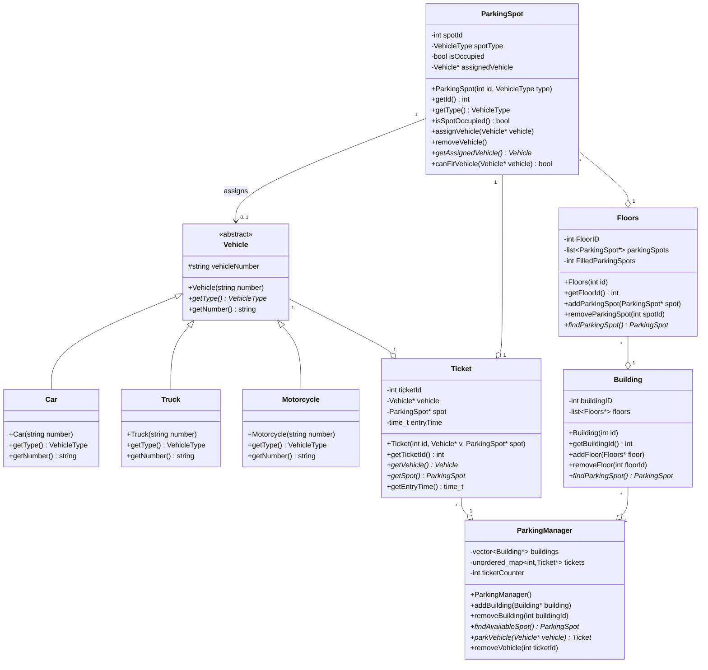
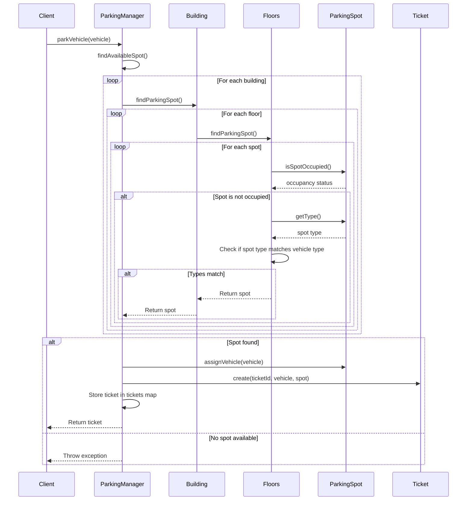
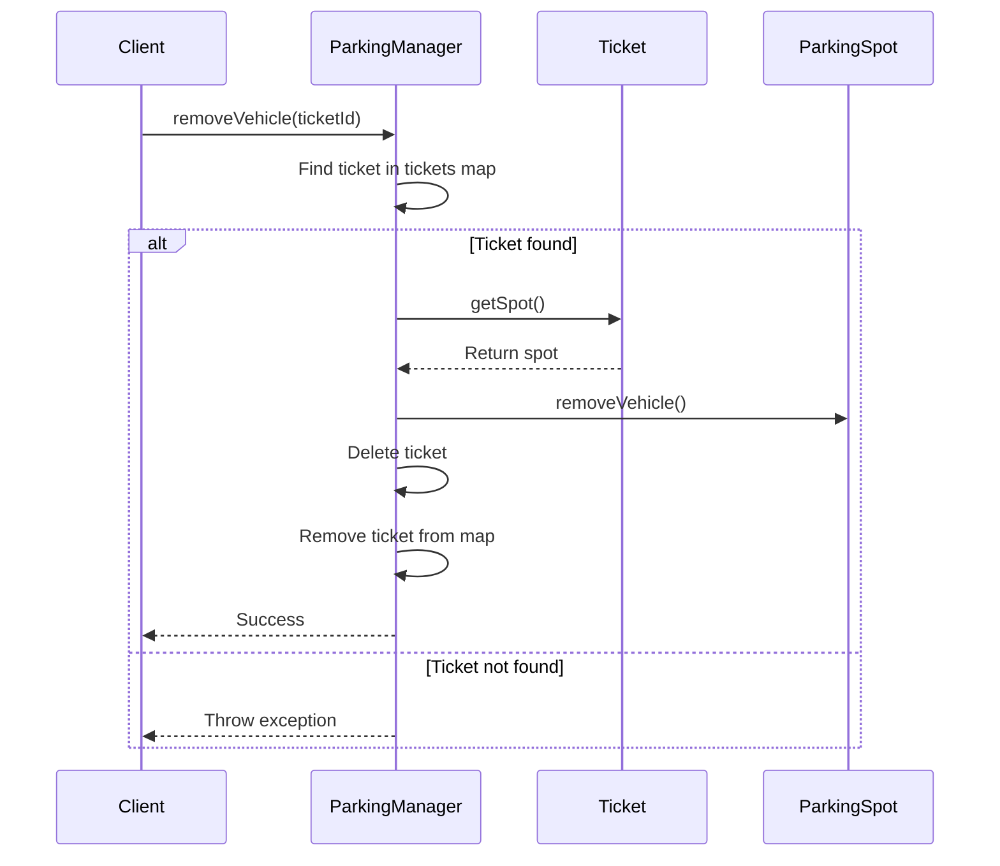
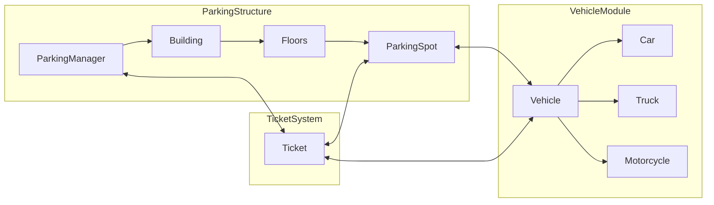
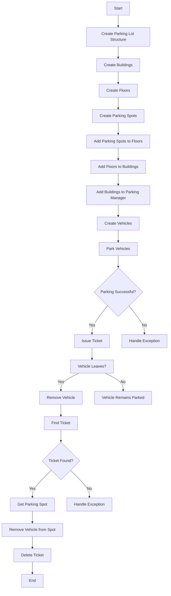

👔 **Interviewer Mode ON**
🎯 **Interview Round: Low-Level System Design**
🧠 **Problem: Design a Parking Lot System**

---

### 🧩 Problem Statement

**You are tasked with designing the object-oriented model of a Parking Lot System.**
The system should support parking for different types of vehicles and should be easily extendable for future requirements like payment, booking, and notifications.

---

### 🎓 Functional Requirements (MVP version)

1. The parking lot can have multiple floors.
2. Each floor has multiple parking spots.
3. There are different types of parking spots for:

   * **Bike**
   * **Car**
   * **Truck**
4. Vehicles should be able to **enter** and **exit** the parking lot.
5. The system should assign the **nearest available spot** to the vehicle.
6. Track the **occupied** and **available** spots.
7. A vehicle can only occupy **one** spot.
8. System should print a **parking ticket** with:

   * Ticket ID
   * Vehicle number
   * Entry time
   * Floor and Spot ID

---

### 🚧 Constraints

* Assume the system is in a **shopping mall** parking.
* Only **manual exit** for now (no automation).
* Ignore real payment integration (for now).
* You can assume a **single entry and exit gate**.

---

### 🔍 Clarifying Questions (I expect you to ask me now as a candidate):

As an interviewer, I expect you to ask questions like:

* How is the size of the lot defined?
* Can a truck occupy more than one spot?
* Is there any reservation system?
* Are electric vehicle spots handled separately?
* Is real-time availability important?

---

### ✅ What I Expect From You

Start by answering or asking any clarifying questions, then:

1.  Define the **key classes** (Vehicle, ParkingSpot, Floor, Ticket, etc.).
2.  Mention important **class relationships** (inheritance/composition).
3.  Talk about the **responsibilities** of each class (SRP).
4.  Use **UML diagram** or write **code-level class structure**.
5.  Discuss how you'd implement **allocation and deallocation** logic.

---

### 💡 Solution Approach

#### 1. Core Classes and Relationships

*   **Vehicle**: An abstract base class with derived classes like `Car`, `Truck`, and `Motorcycle`. This uses inheritance to model different vehicle types.
*   **ParkingSpot**: Represents individual parking spots, each with a `spotId`, `spotType`, and `isOccupied` status. It can assign and remove vehicles.
*   **Floors**: Manages a collection of `ParkingSpot` objects. Each floor has a `floorId` and tracks its filled parking spots.
*   **Building**: Manages a collection of `Floors` objects. A building can have multiple floors.
*   **Ticket**: Stores information about a parked vehicle, including `ticketId`, `vehicle`, `spot`, and `entryTime`.
*   **ParkingManager**: The central orchestrator, managing `Building` objects, handling vehicle parking and removal, and issuing/managing `Ticket` objects.

Relationships are primarily composition (e.g., `Building` composes `Floors`, `Floors` composes `ParkingSpot`). Inheritance is used for `Vehicle` types.

#### 2. Class Responsibilities (SRP)

*   **Vehicle**: Responsible for its type and identification number.
*   **ParkingSpot**: Responsible for its own state (occupied/free) and checking if a vehicle can fit.
*   **Floors**: Responsible for managing parking spots on that floor and finding available spots.
*   **Building**: Responsible for managing floors and delegating spot finding to its floors.
*   **Ticket**: Responsible for storing parking session details.
*   **ParkingManager**: Responsible for the overall parking logic, coordinating between buildings, vehicles, and tickets.

#### 3. Allocation and Deallocation Logic

*   **Parking**: When a vehicle arrives, `ParkingManager` iterates through its `Building` objects, which in turn iterate through their `Floors` to find an available `ParkingSpot` that matches the vehicle's type. Once a spot is found, the vehicle is assigned to it, and a `Ticket` is generated.
*   **Unparking**: When a vehicle leaves, `ParkingManager` uses the `ticketId` to retrieve the `Ticket`, identifies the `ParkingSpot` and `Vehicle`, removes the vehicle from the spot, and deletes the ticket.

#### 4. UML Diagrams (Mermaid)

Here are the visual representations of the system's structure and flow:

##### Class Diagram

##### Sequence Diagram: Parking a Vehicle

##### Sequence Diagram: Removing a Vehicle

##### Flowchart (Left-to-Right)

##### Flowchart (Top-Down)

### 🚀 Optimizations and Future Enhancements

1.  **Smart Pointers**: Replace raw pointers (`Vehicle*`, `ParkingSpot*`, etc.) with smart pointers (`std::unique_ptr`, `std::shared_ptr`) to automate memory management and prevent memory leaks.
2.  **Design Patterns**: 
    *   **Strategy Pattern**: For `findParkingSpot` logic. Instead of hardcoding the search for the "nearest available spot," introduce different strategies (e.g., `NearestSpotStrategy`, `ValetSpotStrategy`, `ElectricVehicleSpotStrategy`) that can be swapped at runtime. This enhances flexibility and adheres to SRP.
    *   **Factory Pattern**: For `Vehicle` and `ParkingSpot` creation. A `VehicleFactory` could create different vehicle types based on input, and a `ParkingSpotFactory` could create different spot types, centralizing object creation.
    *   **Observer Pattern**: For real-time availability updates. `ParkingSpot` or `Floors` could notify `ParkingManager` (or a display system) when their status changes.
3.  **Error Handling**: Implement a custom exception hierarchy for parking-related errors (e.g., `NoSpotAvailableException`, `InvalidTicketException`) to provide more granular error reporting.
4.  **Concurrency**: For a real-world system, consider thread-safety for shared resources like `parkingSpots` lists and `tickets` maps, using mutexes or other synchronization primitives.
5.  **Configuration**: Externalize parking lot configuration (number of floors, spots per floor, spot types) to a configuration file (e.g., JSON, XML) for easier modification without recompilation.
6.  **Scalability**: For very large parking lots, consider partitioning the search space (e.g., by zone or section) to optimize `findAvailableSpot`.
7.  **Payment and Billing**: Integrate a `PaymentProcessor` and `Billing` module to handle payment calculations based on entry/exit times and vehicle type.
8.  **Database Integration**: Persist parking lot state (vehicles, tickets, spot occupancy) to a database to ensure data durability across system restarts.
9.  **Logging**: Implement a robust logging mechanism to track system events, vehicle movements, and errors for debugging and auditing.
10. **Testing**: Implement comprehensive unit and integration tests to ensure the correctness and robustness of the system.